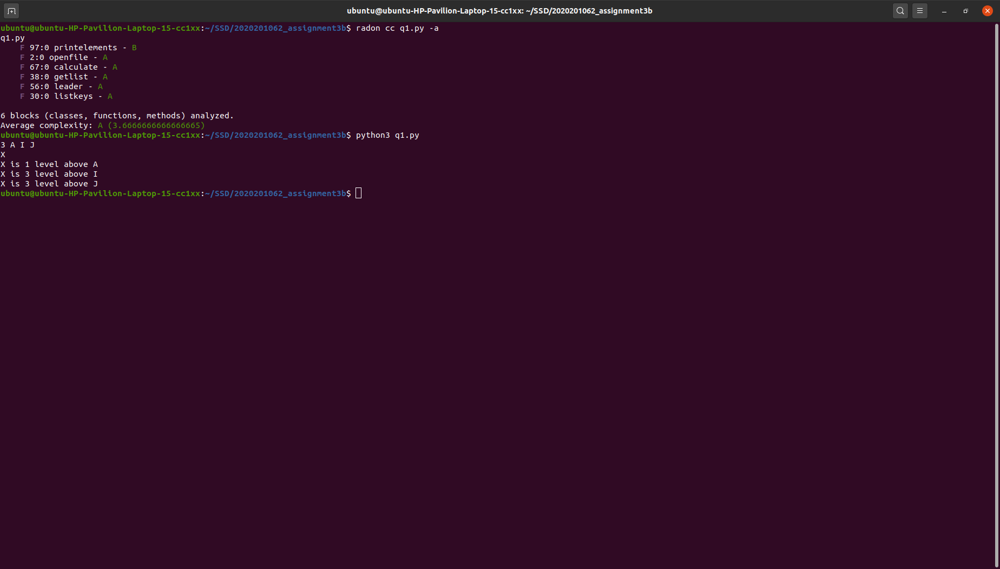
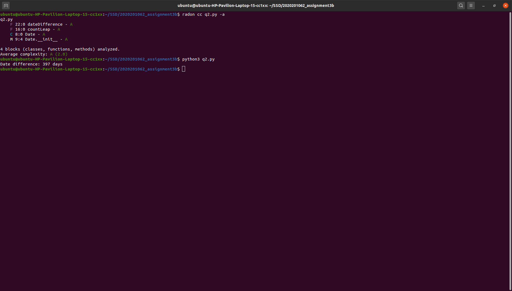
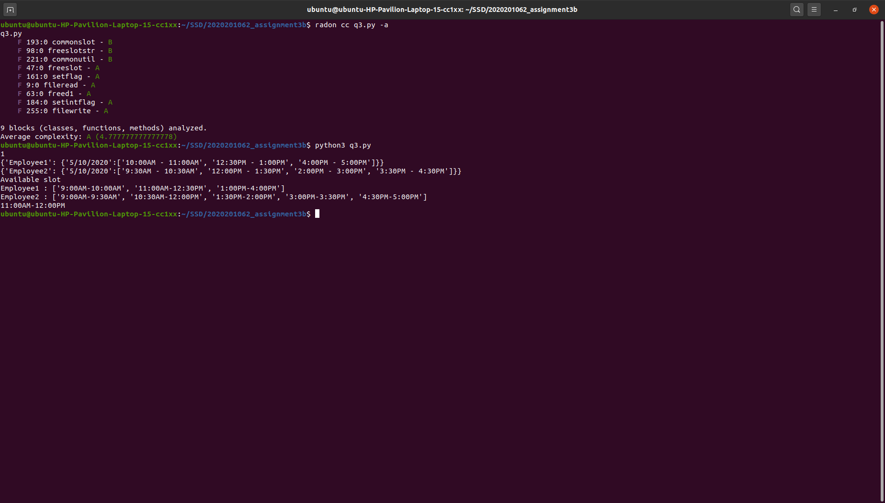

# **ASSIGNMENT-3(part B)**
* I am using python 3.8.5 and the project was developed in sublime text editor.
* Folder contain `q1.py`, `q2.py`, `q3.py` and input - output files `org.json`, `date_calculator.txt`, `Employee1.txt`, `Employee2.txt` ...`Employeek.txt`and `output.txt`
* For question no. 3, `Employee1.txt`, `Employee2.txt` ...`Employeek.txt` files can be given as input file.
* All the file gave correct output on my system
* [https://github.com/aviral-s/2020201062_Assignment3a/tree/PartB]
* All the screenshots of cyclomatic complexity are present in `images` folder

## **Q1**
* input json in `org.json` file.
* input is as follows:
n emp1 emp2 ... empn
* output is generated on terminal as follows:  

xyz  

xyz is number levels above emp1  

xyz is number levels above emp2  

where `xyz` is the leader of the input employees.
* line2, 30, 38, 56, 67, 97 : code is modularised into functions on these line numbers.
* line125-130 : Driver code to call these functions.

## **Q2**
* Input file `date_calculator.txt` contains two dates in two different lines.
* New date formats if present are specified in command line argument like mm/dd/yyyy ,mm.dd.yyyy ,mm-dd-yyyy.
* Output is produced on terminal and also written on `output.txt` 
* Haven't used any python library for date.
* No changes made to previous code.

## **Q3**
* ast and simplejson lib is used as `import ast` and `import simplejson`
* Input is taken from user as 0.5, 1, 1.5 etc as slot duration.
* `Employee1.txt`,`Employee2.txt`,...,`Employeek.txt` contains busy slots of the employees and input is given in it.
* The desired output is produced on `output.txt`
* line9 ,47 ,63 ,98 ,161 ,184 ,193 ,221 ,255 : code is modularised into functions on these line numbers.
* line 291-298 : Driver code to call functions.

